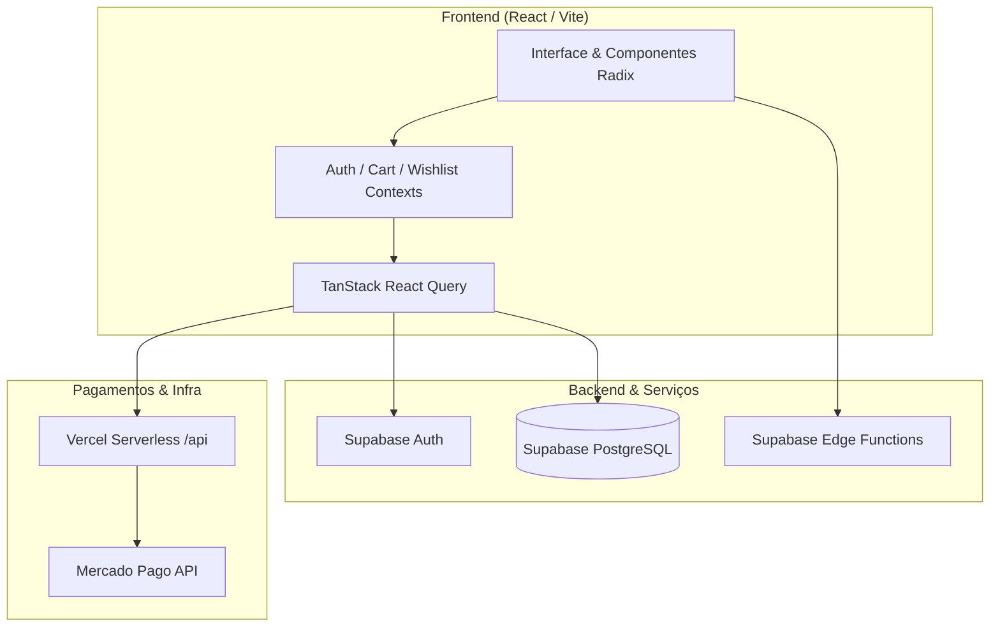

# Void Drip Society 🪐

> Plataforma de e-commerce e catálogo interativo para moda e acessórios streetwear com estética cósmica/futurista, integração completa de pagamentos via Mercado Pago e backend serverless no Supabase.

---

## 📖 Sobre o Projeto

O **Void Drip Society** é uma aplicação completa de e-commerce voltada para a cultura streetwear contemporânea. O projeto combina uma identidade visual marcante (dark mode com elementos cósmicos e microinterações fluidas) com uma arquitetura técnica robusta para suportar jornadas de compra completas: desde a exploração de produtos, aplicação de cupons, gestão de carrinho e lista de desejos, até a geração de checkout real com suporte a PIX e Cartão de Crédito.

---

## ✨ Principais Funcionalidades

- **Catálogo Dinâmico e Filtros**: Navegação por categorias (camisetas, moletons, acessórios, conjuntos), paginação, ordenação e visualização detalhada de peças.
- **Carrinho e Checkout Completo**: Drawer de carrinho reativo com controle de estoque, cálculo de descontos por cupom e integração direta com a API do **Mercado Pago**.
- **Autenticação e Perfis**: Login/Cadastro via Supabase Auth, histórico de pedidos rastreáveis e cupons salvos por usuário.
- **Área Administrativa (Admin Dashboard)**: Painel completo para gestão de produtos, controle de pedidos, emissão/gerenciamento de cupons de desconto e métricas de vendas.
- **Quiz de Estilo ("Vibes Survey")**: Questionário interativo para personalização e recomendação de produtos com base no estilo do usuário.
- **SEO e Dynamic Open Graph**: Suporte a metatags dinâmicas para compartilhamento de produtos via Edge Functions e Vercel Serverless Rewrites.
- **Modo Manutenção**: Chave centralizada para controle de acessibilidade da loja mantendo o painel administrativo acessível.

---

## 🛠️ Stack Tecnológica

### Frontend
- **Core**: React 18 + TypeScript + Vite
- **Estilização**: Tailwind CSS + shadcn/ui (Radix UI primitives)
- **Animações**: Framer Motion
- **Gerenciamento de Estado de Servidor**: TanStack Query (React Query v5)
- **Formulários e Validação**: React Hook Form + Zod
- **Roteamento**: React Router DOM v6
- **Notificações**: Sonner

### Backend e Infraestrutura
- **Banco de Dados & Auth**: Supabase (PostgreSQL, Row Level Security, Auth)
- **Edge Functions**: Supabase Edge Functions (Open Graph dynamic meta generation)
- **Gateway de Pagamento**: Mercado Pago SDK (Checkout transparente & Webhooks)
- **Hospedagem & Serverless**: Vercel (com Serverless Functions para rotas de produto)

---

## 📐 Arquitetura



---

## 📂 Estrutura de Pastas

```text
├── api/                  # Vercel Serverless Functions (ex: /api/produto/[id])
├── docs/
│   └── database/         # Schemas SQL e definições de banco de dados
├── public/               # Assets públicos estáticos (favicons, robots, og-image)
├── src/
│   ├── assets/           # Imagens e mídias estáticas do frontend
│   ├── components/       # Componentes de UI e blocos da aplicação
│   │   └── ui/           # Primitivas de UI (shadcn / Radix)
│   ├── contexts/         # Contextos React (Auth, Cart, Wishlist)
│   ├── hooks/            # Custom hooks (produtos, pedidos, cupons, toast)
│   ├── integrations/     # Clientes de integrações externas (Supabase)
│   ├── lib/              # Funções utilitárias e analytics
│   ├── pages/            # Páginas e rotas da aplicação
│   ├── App.tsx           # Configuração de rotas e providers principais
│   ├── index.css         # Design tokens e classes utilitárias globais
│   └── main.tsx          # Ponto de entrada React
├── supabase/
│   └── functions/        # Edge Functions do Supabase (og-meta)
├── .env.example          # Modelo de variáveis de ambiente
└── vite.config.ts        # Configuração do Vite e otimizações de bundle
```

---

## 🚀 Como Executar Localmente

### Pré-requisitos
- **Node.js**: Versão 18 ou superior
- **npm** (ou package manager de sua preferência)

### 1. Clonar o Repositório
```bash
git clone https://github.com/seu-usuario/void-drip-landing.git
cd void-drip-landing
```

### 2. Instalar Dependências
```bash
npm install
```

### 3. Configurar Variáveis de Ambiente
Crie um arquivo `.env` na raiz do projeto com base no `.env.example`:

```bash
cp .env.example .env
```

Preencha as variáveis de ambiente necessárias:
```env
# Supabase
VITE_SUPABASE_URL=https://sua-instancia.supabase.co
VITE_SUPABASE_ANON_KEY=sua-chave-anon-aqui

# Mercado Pago
VITE_MERCADO_PAGO_PUBLIC_KEY=sua-public-key-aqui
MERCADO_PAGO_ACCESS_TOKEN=seu-access-token-aqui
MERCADO_PAGO_WEBHOOK_SECRET=seu-webhook-secret-aqui
```

### 4. Executar em Modo de Desenvolvimento
```bash
npm run dev
```

Acesse a aplicação em `http://localhost:8080`.

---

## 📦 Scripts Disponíveis

| Comando | Descrição |
|---------|-----------|
| `npm run dev` | Inicia o servidor de desenvolvimento com HMR |
| `npm run build` | Gera o bundle otimizado de produção em `/dist` |
| `npm run preview` | Executa o preview local da build de produção |
| `npm run lint` | Executa o linter ESLint em todo o código |
| `npm run test` | Executa a suíte de testes com Vitest |

---

## 🗄️ Banco de Dados

Os scripts SQL com as definições de tabelas, funções, triggers e políticas RLS (Row Level Security) estão organizados na pasta [`docs/database/`](file:///c:/Users/clire/OneDrive/Área de Trabalho/Sites/void-drip-landing-main/docs/database):

- `schema.sql`: Estrutura principal de produtos, categorias, clientes e pedidos.
- `schema-cupons.sql`: Estrutura do sistema dinâmico de cupons de desconto e resgates.
- `schema-conjuntos.sql`: Estrutura e suporte a kits e conjuntos de peças.

---

## 📄 Licença

Este projeto é desenvolvido para fins comerciais e de portfólio. Todos os direitos reservados à Void Drip Society.
